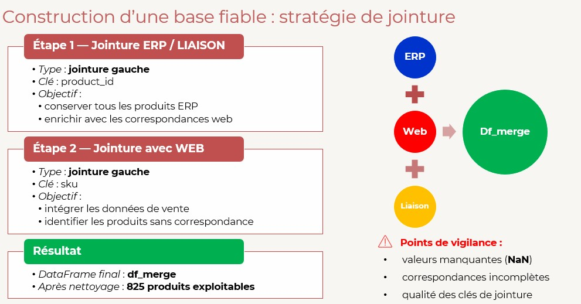
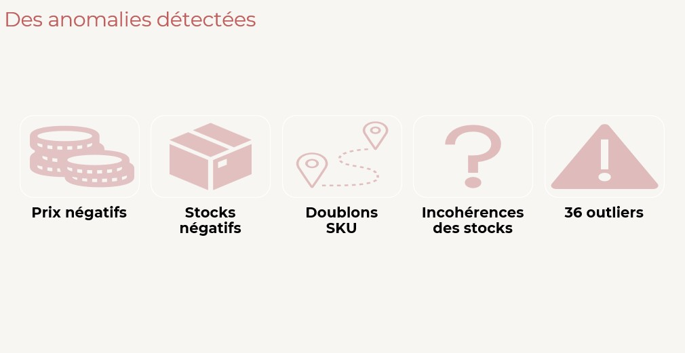
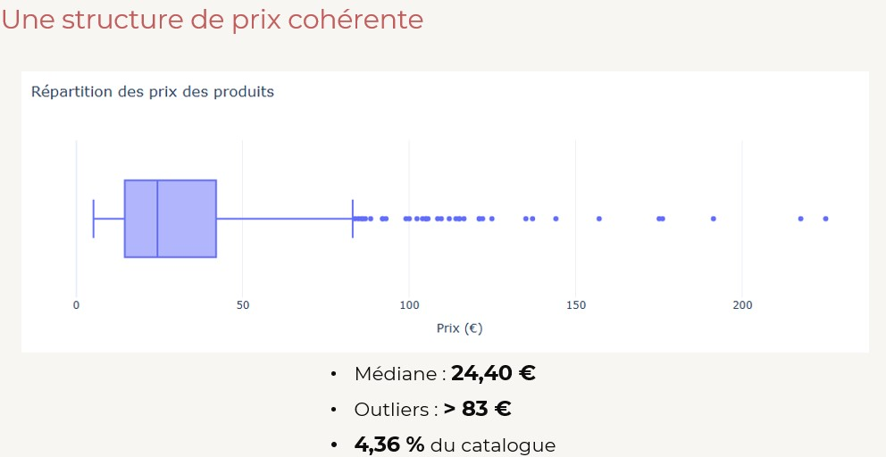
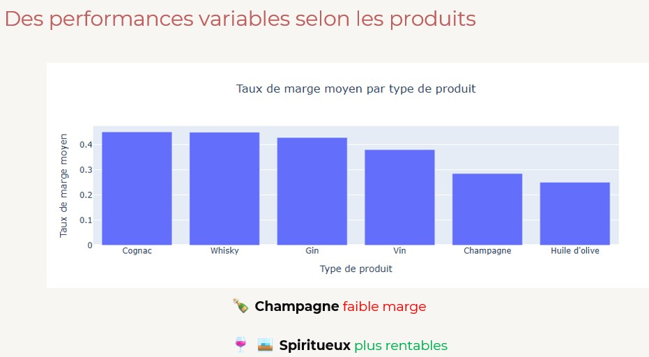
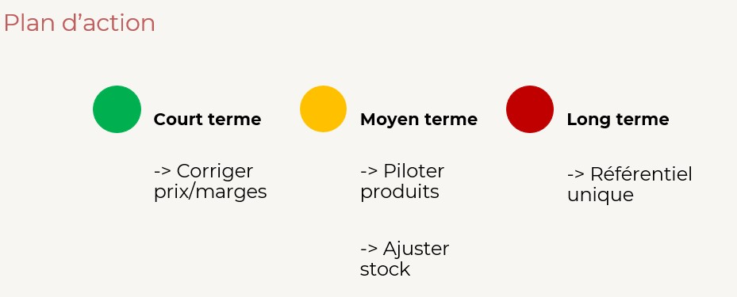

# Analyse des ventes et du stock du site Bottleneck

## Contexte

Projet réalisé dans le cadre de la formation Business Intelligence Analyst (OpenClassrooms).

Bottleneck est un marchand spécialisé dans la vente de vins et spiritueux. L'entreprise dispose de plusieurs sources de données indépendantes :

* un fichier ERP contenant les informations de stock et de prix ;
* un fichier Web contenant les données de vente du site e-commerce ;
* un fichier de liaison permettant de relier les identifiants des deux systèmes.

L'absence de référentiel unique limite la capacité de l'entreprise à analyser ses performances commerciales, piloter ses stocks et identifier les produits les plus rentables.

L'objectif de cette mission était de consolider ces différentes sources afin de construire une base de données fiable et produire des analyses permettant d'améliorer le pilotage de l'activité.

---

## Structure du projet

```text
├── notebook/
│   └── Bottleneck.ipynb
│
├── presentation/
│   └── Presentation_Bottleneck.pdf
│
├── images/
│   ├── schema_jointure.jpg
│   ├── anomalies.jpg
│   ├── distribution_prix.jpg
│   ├── rentabilite.jpg
│   └── plan_action.jpg
│
└── README.md

```

---

## Livrables

* Notebook Python d'analyse
* Dataset consolidé et nettoyé
* Analyse des ventes et du chiffre d'affaires
* Analyse de rentabilité
* Recommandations métier
* Présentation des résultats

---

## Aperçu du projet

### Construction du jeu de données

### Anomalies détectées

### Structure des prix

### Analyse de rentabilité

### Recommandations


---

## Problématique

Comment consolider plusieurs sources de données afin d'obtenir une vision fiable des ventes, du stock et de la rentabilité du catalogue Bottleneck, et identifier les leviers d'amélioration de la performance commerciale ?

---

## Compétences mobilisées

* Data Cleaning
* Data Wrangling
* Analyse exploratoire des données
* Analyse de rentabilité
* Analyse statistique
* Data Visualisation
* Data Storytelling

---

## Technologies utilisées

* Python
* Pandas
* Matplotlib
* Seaborn
* Plotly Express
* Jupyter Notebook

---

## Sources de données

### ERP

Informations internes sur les produits :

* product_id
* price
* purchase_price
* stock_quantity
* stock_status
* onsale_web

### Web

Informations liées à l'activité e-commerce :

* sku
* total_sales
* post_title
* product_type

### Liaison

Table de correspondance entre les deux systèmes :

* product_id
* id_web

---

## Construction du jeu de données

Les trois fichiers ont été consolidés afin de créer une table analytique unique.

### Schéma de consolidation



Deux jointures successives ont été réalisées :

1. Jointure ERP ↔ Liaison via product_id
2. Jointure du résultat avec Web via sku

Cette approche permet de conserver les informations produits tout en intégrant les données commerciales du site e-commerce.

---

## Nettoyage des données

### ERP

Corrections réalisées :

* correction des incohérences entre stock_quantity et stock_status ;
* traitement des prix négatifs ;
* traitement des stocks négatifs ;
* vérification de l'unicité des identifiants produits.

### Web

Corrections réalisées :

* suppression des lignes de type attachment ;
* suppression des SKU non exploitables ;
* suppression des ventes négatives ;
* contrôle des doublons.

### Liaison

Vérifications réalisées :

* unicité des product_id ;
* contrôle des correspondances entre ERP et Web ;
* analyse des valeurs manquantes.

### Principales anomalies détectées



Les contrôles qualité ont permis d'identifier :

* des prix négatifs ;
* des stocks négatifs ;
* des incohérences de stock ;
* des valeurs manquantes ;
* des valeurs atypiques sur les prix.

---

## Jeu de données final

Après nettoyage et consolidation :

* 825 références ERP analysées ;
* 714 produits commercialisés exploitables ;
* aucune anomalie bloquante sur les clés de jointure.

---

## Analyses réalisées

### Analyse des prix

Objectifs :

* étudier la distribution des prix ;
* identifier les valeurs atypiques ;
* analyser la dispersion des prix.



Principaux constats :

* prix médian : 24,40 € ;
* seuil d'outliers : 83 € ;
* 4,36 % du catalogue présente des valeurs atypiques.

---

### Analyse du chiffre d'affaires

Calcul :

```python
ca_par_article = price * total_sales
```

Études réalisées :

* Top 20 des produits générant le plus de chiffre d'affaires ;
* répartition du chiffre d'affaires au sein du catalogue ;
* concentration des ventes.

Résultat :

* environ 52,6 % du catalogue génère 80 % du chiffre d'affaires.

---

### Analyse de rentabilité



Calcul du taux de marge :

```python
(price - purchase_price) / purchase_price
```

Résultats :

* taux de marge moyen : 61 % ;
* présence de produits à marge négative ;
* fortes disparités selon les catégories de produits.

Les catégories Cognac et Whisky affichent les marges moyennes les plus élevées.

---

### Analyse des corrélations

Étude des relations entre :

* stock_quantity ;
* total_sales ;
* price.

Résultats :

* corrélation faible entre prix et ventes ;
* corrélation faible entre stock et ventes ;
* absence de relation linéaire forte entre les variables étudiées.

---

## Résultats obtenus

* Consolidation de trois sources de données distinctes.
* Création d'un dataset analytique fiable.
* Identification de plusieurs anomalies de qualité de données.
* Détection de produits à marge négative.
* Analyse de la répartition du chiffre d'affaires.
* Identification des catégories les plus rentables.
* Mise en évidence des limites du système d'information actuel.

---

## Recommandations

### Court terme

* Corriger les incohérences de prix et de marge.
* Contrôler les produits présentant une rentabilité négative.

### Moyen terme

* Renforcer le suivi des produits les plus performants.
* Adapter les niveaux de stock aux performances commerciales.

### Long terme

* Mettre en place un référentiel unique centralisant les données ERP et Web.
* Automatiser les contrôles qualité et les indicateurs de pilotage.



---

## Ce que ce projet m'a appris

Ce projet m'a permis de :

* consolider des données provenant de plusieurs systèmes ;
* mettre en œuvre des processus de nettoyage de données ;
* identifier des anomalies impactant la qualité de l'analyse ;
* réaliser des analyses de rentabilité et de performance commerciale ;
* transformer des résultats analytiques en recommandations opérationnelles ;
* comprendre l'importance d'un référentiel de données unique pour le pilotage de l'activité.

---

## Données

Les données utilisées dans ce projet sont fictives et ont été fournies dans le cadre d'un exercice pédagogique. Elles ne correspondent à aucune activité réelle.

---

## Réalisé par

Géraldine CHRETIEN

Projet réalisé dans le cadre de la formation Business Intelligence Analyst (OpenClassrooms).
